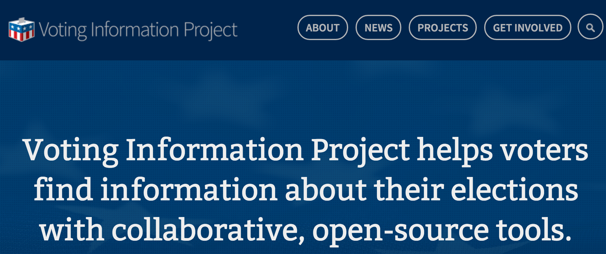

layout:true

  
  
The Benefits of Open Data

  

    
    
      
      

--

class: center,middle

# The Benefits of Open Data

- - -

## Presenter: Richard Dunks

###### &nbsp;

### Follow along at: https://bit.ly/open-data-benefits

#### See the code at: https://bit.ly/open-data-benefits-code

<strong><strong>The Benefits of Open Data</strong></strong> by <a xmlns:cc="http://creativecommons.org/ns#" href="http://www.datapolitan.com" property="cc:attributionName" rel="cc:attributionURL">Richard Dunks</a> is licensed under a <a rel="license" href="http://creativecommons.org/licenses/by-sa/4.0/">Creative Commons Attribution-ShareAlike 4.0 International License</a>

---

name:open-data
# Definition of Open Data
--

> Open data is data that can be freely used, shared and built-on by anyone, anywhere, for any purpose

## - [Open Knowledge International](http://blog.okfn.org/2013/10/03/defining-open-data/)

---

# Benefits of Open Data
--

+ Transparency
--

---

# Benefits of Open Data
+ Transparency
+ Releasing social and commercial value
--

.caption[[AccuWeather](https://www.accuweather.com/)]

---

# Benefits of Open Data
+ Transparency
+ Releasing social and commercial value

.caption[[TransitApp.com](https://transitapp.com/)]

---

# Benefits of Open Data
+ Transparency
+ Releasing social and commercial value

.caption[Source: [NPR](https://www.npr.org/sections/thesalt/2015/03/27/395622262/did-that-restaurant-pass-its-health-inspection-now-yelp-will-tell-you)]

---

# Benefits of Open Data
+ Transparency
+ Releasing social and commercial value
+ Participation and engagement
--

.caption[[Voting Information Project](https://www.votinginfoproject.org/)]

---
exclude:true

# Ways to Learn More
+ [Open Data Handbook](http://opendatahandbook.org/)
+ [State of the Union of Open Data](https://www.datafoundation.org/the-state-of-the-union-of-open-data-ed-3)
+ [Open Data 500](https://www.opendata500.com/)

---

# Contact Information
+ [Email me](mailto:richard[at]datapolitan[dot]com)
+ Check out [my website](https://wwww.datapolitan.com)
+ Connect on [Twitter](https://twitter.com/Datapolitan)
+ Connect on [LinkedIn](https://www.linkedin.com/in/richarddunks/)
+ Follow us on [Instagram](https://www.instagram.com/datapolitan/)
+ Follow us on [Eventbrite](https://www.eventbrite.com/o/datapolitan-18675558166) to learn about our workshops

---

class:middle,center
# Thank You!

## And go find some open data  about your community!

